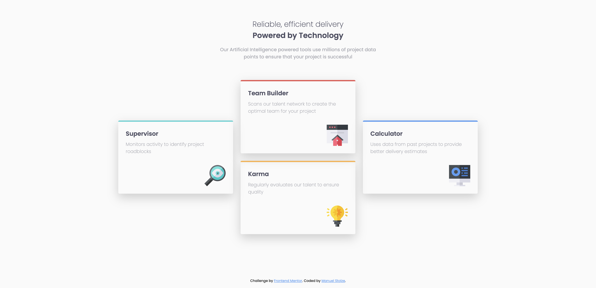

# Frontend Mentor - Four card feature section solution

This is a solution to the [Four card feature section challenge on Frontend Mentor](https://www.frontendmentor.io/challenges/four-card-feature-section-weK1eFYK). Frontend Mentor challenges help you improve your coding skills by building realistic projects. 

## Table of contents

- [Overview](#overview)
  - [The challenge](#the-challenge)
  - [Screenshot](#screenshot)
  - [Links](#links)
- [My process](#my-process)
  - [Built with](#built-with)
  - [What I learned](#what-i-learned)
- [Author](#author)
- [Acknowledgments](#acknowledgments)

**Note: Delete this note and update the table of contents based on what sections you keep.**

## Overview

### The challenge

Users should be able to:

- View the optimal layout for the site depending on their device's screen size

### Screenshot

### Links

- Solution URL: [Github](https://github.com/manuelstolze/four-card-feature-section)
- Live Site URL: [Vercel](https://four-card-feature-section-five-lemon.vercel.app/)

## My process

### Built with

- Semantic HTML5 markup
- CSS custom properties
- Flexbox
- CSS Grid
- Mobile-first workflow

### What I learned

I focused on improving my CSS Grid skills in this project. I learned how to create a grid layout with multiple rows and columns and how to place items in specific grid areas. This helped me to create a more complex layout with multiple cards and different sections.

## Author

- Website - [Manuel Stolze](https://github.com/manuelstolze)
- Frontend Mentor - [@manuelstolze](https://www.frontendmentor.io/profile/manuelstolze)

## Acknowledgments
